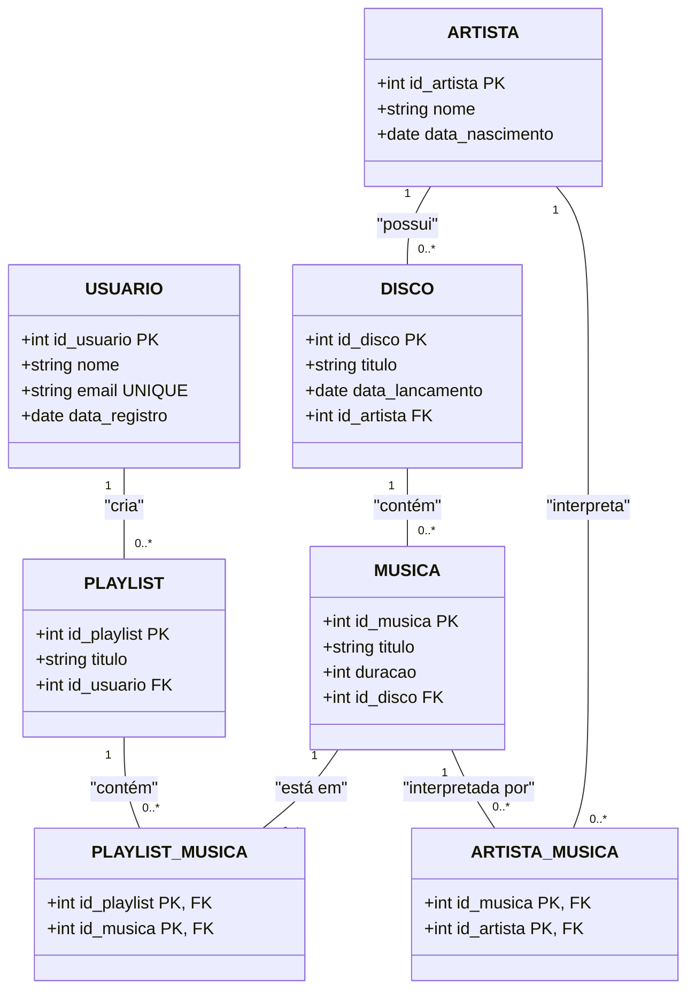

```mermaid
classDiagram
    %% Definição das Classes (Tabelas)
    
    class USUARIO {
        +int id_usuario PK
        +string nome
        +string email UNIQUE
        +date data_registro
    }
    
    class PLAYLIST {
        +int id_playlist PK
        +string titulo
        +int id_usuario FK
    }
    
    class MUSICA {
        +int id_musica PK
        +string titulo
        +int duracao
        +int id_disco FK
    }
    
    class ARTISTA {
        +int id_artista PK
        +string nome
        +date data_nascimento
    }
    
    class DISCO {
        +int id_disco PK
        +string titulo
        +date data_lancamento
        +int id_artista FK
    }
    
    class ARTISTA_MUSICA {
        +int id_musica PK, FK
        +int id_artista PK, FK
    }
    
    class PLAYLIST_MUSICA {
        +int id_playlist PK, FK
        +int id_musica PK, FK
    }
    
    %% Definição dos Relacionamentos
    
    USUARIO "1" -- "0..*" PLAYLIST : "cria"
    PLAYLIST "1" -- "0..*" PLAYLIST_MUSICA : "contém"
    MUSICA "1" -- "0..*" PLAYLIST_MUSICA : "está em"
    MUSICA "1" -- "0..*" ARTISTA_MUSICA : "interpretada por"
    ARTISTA "1" -- "0..*" ARTISTA_MUSICA : "interpreta"
    DISCO "1" -- "0..*" MUSICA : "contém"
    ARTISTA "1" -- "0..*" DISCO : "possui"
```
