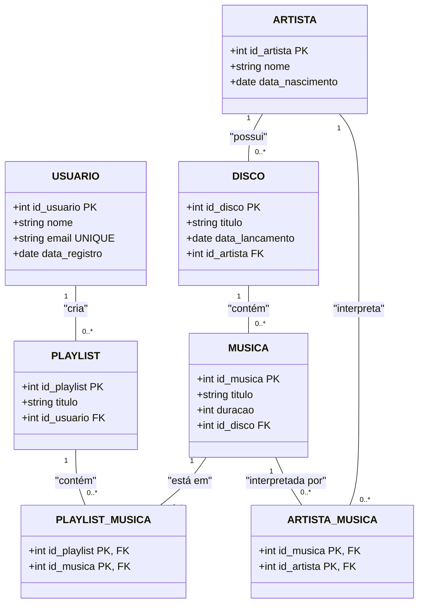

# Sistema de Streaming de Música 🎧

## 📈 Objetivo 📈

O objetivo deste projeto é desenvolver um banco de dados robusto para um sistema de streaming de música. O sistema permitirá que usuários pesquisem músicas, criem playlists e acompanhem artistas e discos. Este README detalha a estrutura do banco de dados, as tecnologias utilizadas, o código SQL para criação e inserção de dados, bem como consultas essenciais para o funcionamento do sistema.

## 👾 Tecnologias Utilizadas 👾

 
    
    

 

## 🍃 Detalhes do Projeto 🍃
Para todos os tópicos, basta clicar no título que você será direcionado para o arquivo dos códigos e tabelas.

### 📍 [Modelo Entidade Relacionamento (ER)](https://github.com/z0mer/PJ.BANCO_DE_DADOS/blob/main/DigramaRelacional.md)

O modelo ER detalha as entidades principais do sistema e seus relacionamentos. A seguir, está o diagrama relacional utilizado no projeto.

---

### 📍 [Modelo Relacional na 3FN](https://github.com/z0mer/PJ.BANCO_DE_DADOS/blob/main/ModeloRelacional.md)
O Modelo Relacional na 3ª Forma Normal (3FN) foi projetado para eliminar redundâncias e garantir a integridade dos dados. Cada tabela foi normalizada para atender às regras da 3FN, assegurando que não existam dependências transitivas e que cada atributo não-chave dependa diretamente da chave primária.

---

### 📍 [Criação das Tabelas](https://github.com/z0mer/PJ.BANCO_DE_DADOS/blob/main/CriarTabelas.sql)
A criação das tabelas é fundamental para estruturar o banco de dados de acordo com os requisitos do sistema de streaming de música. Cada tabela representa uma entidade ou um relacionamento entre entidades no modelo ER.

- Artista: Armazena informações sobre os artistas, incluindo um ID único, nome e data de nascimento.
- Disco: Representa os discos lançados pelos artistas, contendo um ID único, título, data de lançamento e uma referência ao artista.
- Musica: Contém detalhes sobre as músicas, como ID, título, duração e referência ao disco ao qual pertencem.
- Usuario: Armazena informações dos usuários do sistema, incluindo ID, nome, e-mail único e data de registro.
- Playlist: Representa as playlists criadas pelos usuários, com ID, título e referência ao usuário que a criou.
- Musica_Playlist: Tabela de relacionamento que associa músicas às playlists, permitindo que uma música pertença a várias playlists e vice-versa.
- Artista_Musica: Tabela de relacionamento que associa músicas aos artistas, possibilitando que uma música seja interpretada por múltiplos artistas.

---

### 📍 [Inserção de Dados](https://github.com/z0mer/PJ.BANCO_DE_DADOS/blob/main/Dados.sql)
A inserção de dados populou as tabelas com informações iniciais para teste e demonstração do sistema. É importante notar que os IDs dos artistas foram inseridos em ordem crescente conforme solicitado.

- Artista: 10 artistas foram adicionados com IDs de 1 a 10.
- Disco: 15 discos foram inseridos, cada um associado a um artista específico.
- Musica: 33 músicas foram inseridas, cada uma vinculada a um disco.
- Usuario: 5 usuários foram cadastrados no sistema.
- Playlist: 11 playlists foram criadas, associadas aos usuários.
- Musica_Playlist: As relações entre músicas e playlists foram estabelecidas.
- Artista_Musica: As relações entre músicas e artistas foram definidas, incluindo músicas com múltiplos artistas.

---

### 📍 [Queries para Álgebra Relacional](https://github.com/z0mer/PJ.BANCO_DE_DADOS/blob/main/QueriesAlgebraRelacional.sql)
As consultas SQL resolvem as 20 questões propostas, baseadas no modelo ER descrito anteriormente.

---

## Autores ✒️
Anna Carolina Zomer ⬇️ 

Humberto Pellegrini ⬇️ 

