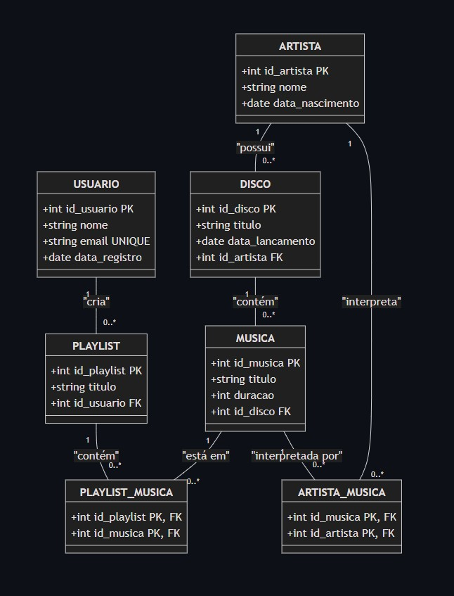

# 🎵 Sistema de Streaming de Música 🎧

## Sobre o Projeto 🖥️

Este projeto consiste no design e implementação de um banco de dados para um sistema de streaming de música. O sistema permite que usuários pesquisem músicas, criem playlists e acompanhem artistas e discos. A seguir, você encontrará os principais tópicos e documentos relacionados ao desenvolvimento do sistema.

| 🔨 |
|---------|
| [Modelo Entidade Relacionamento (ER)](https://github.com/z0mer/seu-repositorio/blob/main/DigramaRelacional.md) |
| [Modelo Relacional na 3ª Forma Normal (3FN)](https://github.com/seu-usuario/seu-repositorio/blob/main/ModeloRelacional.md) |
| [Criação das Tabelas e Inserção de Dados](https://github.com/seu-usuario/seu-repositorio/blob/main/CriarTabelas.sql) |
| [Queries para Álgebra Relacional](https://github.com/seu-usuario/seu-repositorio/blob/main/QueriesAlgebraRelacional.sql) |
| [Código para Geração de Dados Aleatórios](https://github.com/seu-usuario/seu-repositorio/blob/main/Dados.sql) |

## Diagrama Relacional 📊

O diagrama relacional utilizado no projeto pode ser visualizado abaixo ⬇️

  

